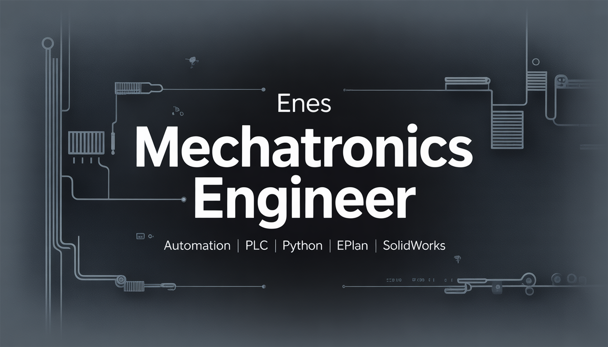

# 👋 Hi, I’m Enes,
I’m Enes, a **Mechatronics Engineer** with an interest in automation, control systems, and software development. I enjoy combining electrical, mechanical, and software knowledge to build practical solutions.

---

## 🛠️ Skills & Competencies

- ⚡ Reading and understanding **electrical & control system schematics**
- 🧠 **PLC & HMI programming**
- 🔌 **Arduino programming**
- 🐍 Learning **Python** (fundamentals & practical usage)
- 🗄️ Learning **databases** (starting with SQLite)
- 🧩 Learning **EPLAN** for electrical schematics and documentation

---

## 💻 Tools & Software

- 🏭 **TIA Portal** (PLC & HMI)
- **EPLAN** (Electrical design & schematics)
- 🛠️ **SolidWorks** (Mechanical Design)
- 🧠 **Arduino IDE**
- 💻 **VS Code**
- 🔧 **Git & GitHub**

---

## 📌 What I Do
- Develop Python applications
- Work on automation & PLC projects
- Build Arduino-based systems
- Design mechanical parts using SolidWorks
- Developing skills in electrical design with EPLAN  

---

## 🎯 Goals
- Build real-world Python & automation projects
- Improve problem-solving skills
- Learn backend development deeply
- Combine software with hardware & mechanics
